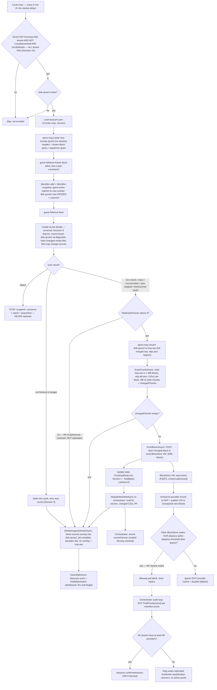

# DeCloud — Compliance Integration Plan

**Status:** Active — build sequencing for the pre-launch compliance framework
**Created:** 2026-06-26
**Updated:** 2026-07-14 — Phase 6 **pass 1 built and verified** (scanner seam + honest stub, fleet-wide enrollment per Decision 15, the Decision 9 result-gate, and the node `csam-report` → P0 queue → protective-suspend chain; 8/8 orchestrator + 16/16 node smoke tests). D1 settled and recorded (scan-only dirty bitmap — not built; lands with the real matcher). Hold propagation hardened: heartbeat `HeldVmIds` diffing (holds and releases), autostart discipline, watchdog truce. Phase 4 admin UI shipped. Phases 1–5 as previously recorded: ToS built; Enforcement Core complete (three-chokepoint gate, hardened single-VM hold, operator-node takedown chain with settlement withheld); Template Review Gate with draft-revision versioning; Abuse Reporting intake → P0 queue → enforcement; DMCA = no new code (operational/legal). The real matcher and NCMEC reporting remain gated on §2; the honest external claim is still *"reactive detection + template-publish review"*, not *"proactive CSAM scanning"*. See the build log (§7) for detail and the open follow-ups.
**References:** `COMPLIANCE.md` (authoritative spec), `PROJECT_FEATURES.md` §10, `MINECRAFT_VISION_ROADMAP.md`
**Scope:** Turns the four-pillar framework in `COMPLIANCE.md` into a dependency-ordered build plan, grounded in the current code in `DeCloud.Orchestrator`, `DeCloud.NodeAgent`, `DeCloud.Shared`, and the `DeCloudEscrow.sol` contract.

This plan supersedes scattered "Planned" notes where they conflict. Where it states a decision, that decision was made deliberately and should not be silently reverted; reopen it explicitly if a new constraint appears.

---

## 1. Locked Decisions (the ledger)

These hold across all phases. They are the result of design discussion, not defaults.

1. **CSAM detection surface = node-level filesystem scanning, not block-store hashing.**
   The Block Store holds raw 1 MB sectors at arbitrary offsets (content-addressed CIDs over `tmp.raw` chunks); whole-file hash matching is impossible there. `PROJECT_FEATURES.md` currently describes block-store ingestion hashing — that is **wrong** and must be corrected to match `COMPLIANCE.md` and the code.

2. **Escrow forfeiture is removed from scope — not deferred.**
   `DeCloudEscrow.sol` v3 has no function to move user funds (explicit contract comment: *"There is NO admin function to drain user funds"*), and `withdrawBalance()` has no pause/freeze gate, so a user can always exit. Faking usage to seize funds is a defeatable override and an anti-pattern. Forfeiture would require a contract redeployment via the migration path. **We do not build it.** The ToS may *reserve* a future cost-recovery right only if counsel advises it is worth having.

3. **Enforcement = withhold-service-only.**
   Platform enforcement never touches deposited funds. It refuses to schedule VMs for a blocked wallet, terminates running VMs, and blacklists. The contract's "user funds are sacrosanct" invariant is treated as a regulatory asset, not a limitation.

4. **Two boundaries, one gate.**
   - `User.Status = Suspended` is the authoritative boundary for **internal, platform-originated** suspensions (someone who acted here and was suspended for it). `UserStatus { Active, Suspended, Deleted }` already exists and is already enforced at token refresh.
   - A provenance-bearing **`BlockedWallets`** denylist is the boundary for **proactive / imported** blocks (sanctions lists, law-enforcement lists, cross-platform intel). Keyed by wallet address; each entry carries `source` (sanctions | law_enforcement | cross_platform | internal), `reason`, `reference`, `addedBy`, `addedAt`. Bulk-importable. Removal is **source-scoped** (a sanctions re-import must never clobber an internal takedown, and vice versa). It **never creates a `User` row**.
   - Both compose into a single predicate, **`IsWalletBlockedAsync(wallet)`**, checked server-side at the action chokepoints. One gate function, two stores answering two different questions.
   - **Checksum-normalize on both write and read** (`AddressUtil().ConvertToChecksumAddress`). Imported lists arrive lowercased; a case mismatch is a silent bypass.

5. **Gate is checked server-side at action time, never via the JWT claim.**
   Access tokens live ~60 min and carry a stale `user_status`. Refusal must re-fetch state at each chokepoint, not trust the token.

6. **AI triage is deferred; manual admin review replaces it for launch.**
   Keep the seams clean so AI slots in later without rework: a nullable `AiAssessment` field on `VmTemplate`, and a **deterministic category→priority/SLA map** for abuse triage (the exact shape an AI would later output). No model calls in v1.

7. **Enforcement vocabulary stays distinct from the existing data-locality `Compliance` trigger.**
   `TransitionTrigger.Compliance` + `NonCompliantSince`/`NonComplianceReason` already exist and mean *geographic/locality* compliance (migrate a VM off a node whose locality violates constraints). Do not overload it. Use `Enforcement` / `VmStatus.Suspended` for legal enforcement.

8. **Admin role string is `"Admin"`.**
   `AdminUserInitializer` assigns `"Admin"`. `SystemController` has a pre-existing bug using lowercase `"admin"` in `[Authorize(Roles = "admin")]` that silently fails the role check. Do not replicate it; new admin endpoints use `"Admin"`.

9. **CSAM replication ordering = scan-before-replicate; gate on the scan *result*, not on "clean".**
   The scan runs on the frozen snapshot before `PushBlocksAsync`, and replication is gated on its result — the four states (`NotScanned | Clean | Match | Unscannable`) are **not** a clean/not-clean binary:
   - **Match → block + contain.** Never replicate; suspend + preserve + report (§Phase 6).
   - **Not finished this cycle (budget overrun) → defer.** Retry next round; don't publish content the scan hasn't cleared *yet*. Deferral keeps content on the origin and only postpones redundancy — the sole cost is a temporary durability gap if the origin dies mid-window.
   - **Completed non-match → replicate.** `Clean`, `Unscannable`, and type-skipped all proceed to the `RF>0` push. And while no real matcher is wired, the honest `NotScanned` stub-state proceeds too: **replication must never be blocked merely because a matcher isn't in place**, or the stub would halt the whole platform. *Only a positive match blocks.*
   Forward-compatible with future encryption-at-rest, which slots in *after* the scan clears (Cross-Phase Notes).

10. **Single-VM hold is an orthogonal `VirtualMachine.ComplianceHold` flag, not `VmStatus.Suspended`.**
   Holding one VM (as opposed to suspending a whole wallet) sets a dedicated bool, not the `VmStatus.Suspended` enum value. A status value is overwritten by heartbeat/lifecycle state sync — the node continuously reports a VM's live state, so a status-based hold would be clobbered the moment the VM is observed. An orthogonal flag survives every sync. The node persists the **same** flag in `vms.db` (schema **v9**) and gates its VM manager on it, so the hold holds across node restarts and *before the first heartbeat*. `VmStatus.Suspended` (enum value 5, still transition-less) is left unused for this purpose. **This supersedes Phase 6 step 2's "add `VmStatus.Suspended` transitions"** — Phase 6 reuses `ComplianceHold` instead.

11. **The node enforces; the orchestrator owns desired run-state.**
   The node agent enforces holds and reboots *hung Running* VMs, but it never decides whether a *Stopped* VM should run — it does not `virsh start` a stopped domain on its own. Whether a stopped VM should be running is desired-state, owned by the orchestrator. This is the boundary that keeps the node from reviving owner-stopped, admin-held, or crashed VMs, and is why the health watchdog is gated on `Status == Running`. Consequence, recorded deliberately: node-side auto-recovery of genuinely *crashed* tenant VMs is gone; if wanted it belongs in orchestrator reconciliation with an explicit desired/intended run-state (see §7, open follow-up).

12. **Operator-node takedown = scheduling-off → drain → hard cutoff, graceful-evacuate-first by default.**
   Blocking a wallet that *operates* nodes (not just owns VMs) takes those nodes down in three stages. (a) **Immediately:** `IsSchedulingReady = false` + `NodeStatus.Suspended`, and `LoginNodeAsync` gated so the operator cannot re-enable scheduling. The scheduler already rejects such nodes (FILTER 1 on `Status != Online`, FILTER 1.5 on `!IsSchedulingReady`). (b) **Drain:** the node's *replicated* tenant VMs are evacuated to clean nodes through the **existing** offline-DR migration pipeline — its per-cycle retry and `Unrecoverable` terminal state are the "smart retry"; no parallel drain engine. Only confirmed-replica (`Protected`/`Replicating`) VMs are drained; unconfirmed ones finish seeding on the still-alive source first. **Ephemeral (factor 0) VMs are not drainable** — they resolve to `LazysyncStatus.Lost` at cutoff, by the tenant's own no-durability choice, and never gate the drain. (c) **Hard cutoff** (built): once no drainable replicated VMs remain (verified against the *manifest*, not the race-prone `LazysyncStatus`), revoke JWT + deregister — keeping the JWT live *through* the drain, since `DeregisterNodeAsync` deletes the node record and a VM still pointing at that `NodeId` would be stranded. Graceful-evacuate-first is the default; **immediate hard cutoff is an explicit per-takedown admin override** (`POST /api/admin/compliance/cutoff`), built. It collapses the *grace*, not the *ordering*: ephemeral/unconfirmed VMs are lost at t=0 and confirmed ones migrate from their DHT replica, with the node deregistered a cycle or two later — a literal same-instant deregister is impossible since it would strand the recoverable VMs. The override is a deliberate second action, not a flag, so it can't fire by accident.

13. **Settlement to a blocked operator is withheld, not forfeited.**
   On-chain payout flows only through `GetPendingSettlementsAsync` → the settlement loop, keyed on the node (payee) wallet. A blocked payee's batch is skipped, so the orchestrator never signs a USDC transfer to a suspended/sanctioned wallet — covering both pre-block accrued usage and third-party usage hosted during the drain. The `UsageRecord`s **persist unsettled** (not dropped), so legitimately-earned pre-block income settles normally if the wallet is later cleared. The gate is on the payee only (a blocked *tenant* must not stop a legitimate operator being paid). Permanent forfeiture (sanctions) stays an out-of-band legal action, never a settlement-loop decision.

14. **Already-replicated offending content is quarantined by CID (not by VM); preserve-not-purge.**
   **Scope (2026-07-08): deferred to a later pass — not the first Phase 6 build.** The first pass relies on Decision 9 (a live-scan match never replicates), so VM suspension + overlay preservation is the whole containment story and none of the below is needed yet. This decision is the design for the *later* pass handling the retroactive / backlog / bypassed-origin cases (with the reactive abuse path, Phase 4 P0, as the interim control), and it carries **D2** (the sealed evidence store). Kept here; not built now.
   A held VM stops replicating immediately — lazysync excludes held VMs (`!ComplianceHold`), so replication halts the moment the node knows of the hold. But holding doesn't walk back blocks already in the block-store/DHT, and purging them collides with CSAM evidence-preservation (NCMEC/legal hold). So already-replicated offending content is **quarantined** — stop announcing, stop serving, retain under seal — and the right key is the **CID**, not the VM.
   **When can a *replicated* block even be offending?** Scan-before-publish (Decision 9) means a match stops at the origin and never replicates — so in steady state, never. The only cases are the ones the origin scan couldn't have caught: **retroactive** knowledge (the file wasn't in the hash set when it published; the hash list adds it later), the **pre-scanner backlog** (content replicated before the matcher was wired — all `NotScanned`), and a **bypassed/hostile origin** (modified node software that skipped the scan). All three are discovered *externally* to the holder — a central hash-list update, a backfill sweep, an abuse report, an audit — never by the node itself. That is why the trigger is an admin/orchestrator declaration and the unit is **content**: detection learns "*this hash* is bad," and the same content can sit under many owners or outlive its original VM.
   **Mechanism — authenticated CID declaration → signed broadcast → per-node quarantine + denylist.** An **authenticated admin endpoint declares offending CID(s)**; the orchestrator broadcasts them on a GossipSub topic reusing the exact **HMAC-signed, anti-replay** pattern the `vm-deleted` path already proves. Every subscriber node holding a declared CID runs the quarantine procedure, and the CID is added to a **durable denylist** that refuses it on future publish/replicate too (the content-blocklist analog of the wallet denylist — closes the "it re-arrives later" gap). Human-triggered by design, matching the locked no-automated-CSAM-action rule.
   **The per-node action is one move, grounded in the block-store binary.** Instead of `DeleteBlock` (the `vm-deleted` path), the node **moves the block out of the live blockstore `n.bstore` into a sealed store**. Because **bitswap and GC operate only on `n.bstore`**, that single move gives **serve-deny** (bitswap serves only from `n.bstore`) and **GC-exemption** (GC evicts only from `n.bstore`) for free; dropping the CID from the ~10-min `reannouncePass` lets its DHT provider record **expire on the ~24h TTL** (libp2p has no active un-provide). The three "primitives" I earlier feared collapse into one move + stop-reprovide — a preserve-not-purge sibling of a proven path.
   **Keying on CID dissolves the shared-block question.** Because quarantine acts on content, "who else owns this CID" isn't a policy call — every holder of a known-CSAM CID quarantines it, which is exactly right; the delete path's `cidHasOtherOwners` *skip* must **not** be inherited (skipping would leave known-CSAM served for a co-owner). The only real care is at declaration time: declare the CIDs that reconstruct the flagged **file**, not incidental filesystem-structure/zero blocks that dedup with innocent VMs by coincidence — the declarer's job, not a per-node dilemma.
   **Security-first caveat.** An endpoint that can declare arbitrary CIDs offending and trigger mesh-wide quarantine is a powerful lever: it carries the same HMAC signing as `vm-deleted`, a full audit trail (who declared what, when, on what basis), human-in-the-loop, and guards against declaring legitimate content. That rigor is part of the design, not an add-on.
   **Open (D2): only the sealed evidence store** — where quarantined blocks physically live, encryption at rest, access control, retention, and who authorizes eventual deletion. A custody question for counsel (§2252A handling), tied to the Phase 6 sealed-storage prerequisite (§2). Everything else here is settled. *(Also grounded, high confidence: the DHT provider-lookup — 503-on-indeterminate — and XOR-proximity layer the audit loop and scatter rely on; see §3.1.)*

15. **CSAM scan scope is decoupled from replication factor — every tenant VM with a writable overlay is scanned, `RF=0` included.**
   Hooking the scan at the lazysync `ScanChunks→Push` seam scopes it to `ReplicationFactor > 0`; `RF=0` (ephemeral) VMs are skipped by lazysync entirely (Decision 12 already treats them as non-durable), so they would never be scanned — making a safety property a side effect of a durability opt-in a user can simply decline. Invert it: **scan every tenant VM with a writable overlay; replication — and Decision 9's scan-before-replicate gate — is the `RF>0` tail on the same frozen snapshot.** For `RF>0` the scan shares lazysync's snapshot access and gates the push; for `RF=0` the scan is detection-only (no replication to gate) and needs its own lightweight change-source — the qcow2 overlay's allocated clusters, or a scan-only dirty bitmap. Today's full-export CID-diff is too costly to run per ephemeral VM just to scan. **On the bitmap (D1 note):** it was dropped not as dead weight but because replication moved from *overlay-only* (ship the overlay's changed blocks, tracked by the bitmap) to *full merged-image* capture — overlay-only broke base-image coherence during **cross-node reconstruction** (the target node assembling base image + overlay pieces didn't line up), so the fix was to capture a self-contained merged image and diff it by content hash, which left the bitmap purposeless. That failure was a *replication-reconstruction* problem; a scan-only bitmap (or an overlay-allocated-clusters read) never reconstructs anything cross-node — it's just a local "what did the guest write" read-filter — so the bug that killed the bitmap does **not** apply to reusing one for scanning. Settle this before building. **Out of scope for node-FS scanning:** system VMs (vetted platform code, no tenant data), and **containers** (`DeploymentMode.Container` has no qcow2 overlay — a separate surface, covered only reactively for now).
   **D1 settled (2026-07-08): the `RF=0` change-source is a scan-only persistent QEMU dirty bitmap (option b) — recorded now, built with the real matcher.** The grounding overturned the earlier lean toward overlay-allocated-clusters (option a). Option (a)'s premise — "read the overlay's allocation to learn what changed" — does not hold in the Phase J flow as coded: `SyncVmAsync` merges the overlay back into `disk.qcow2` at the end of **every** cycle (step 8), so between cycles there is no overlay to read, and a self-contained `disk.qcow2`'s allocation is cumulative since creation, not "since last cycle." To make (a) work, the RF=0 flow would have to keep a live overlay across the inter-cycle window (defer the merge one cycle, juggle a 2-deep backing chain, extend crash-recovery and the delete path) — i.e. it does not *reuse* state QEMU already keeps; it would have to *create and maintain* that state by restructuring the proven, coherence-critical snapshot machinery. Option (b) is additive and self-contained: `block-dirty-bitmap-add` (persistent) once per enrolled VM, one `query-named-block-nodes` dirty-count read per cycle, and a `block-dirty-bitmap-clear` at the frozen point. count == 0 ⇒ skip the snapshot **and** the guestmount entirely — and the mount (libguestfs appliance boot, seconds per VM) is the actual per-cycle cost the signal exists to avoid on nodes dense with idle ephemeral VMs. Fail-closed for a safety scan means failing toward *more* scanning: a missing/unreadable bitmap is treated as dirty, never as quiet. The bug that killed the old bitmap was a replication-reconstruction failure and does not apply (per the D1 note above). One caveat recorded honestly: the bitmap's semantics across the blockdev-snapshot + block-commit dance (clear right after `CreateSnapshotAsync`; the later commit re-dirties the window's writes so they count next cycle — content-correct, timing-shifted) is reasoned from QEMU 8.2.2 documentation, not yet executed — smoke-test it when the real matcher lands, before relying on count==0 to skip scans.

---

## 2. Counsel / Administrative Items (non-code, pre-launch)

These are explicitly **not** engineering decisions. They block launch but not the build.

- [ ] Retain legal counsel familiar with CFAA, DMCA, and 18 U.S.C. § 2258A / § 2252A.
- [ ] Counsel to advise on **money-transmission / custody classification** (does any fund-control capability trigger MSB / custody obligations?). Drives whether the ToS reserves any future cost-recovery right.
- [ ] Counsel to advise on **OFAC sanctioned-address screening** obligations (the SDN list includes wallet addresses) — feeds the `BlockedWallets` import sources.
- [ ] File DMCA Designated Agent with the US Copyright Office ($6, https://www.copyright.gov/dmca-directory/).
- [ ] Establish NCMEC CyberTipline account and reporting procedure.
- [ ] Microsoft CSAM Matching API account + agreement (Phase 6).
- [ ] Draft + legally review the ToS document (Phase 1 needs the text + hash).
- [ ] Retroactive rubric review of the Private Browser (Ultraviolet) and Shadowsocks seed templates (Phase 3).

---

## 3. Code-Grounded Starting State

Verified against the repos so future readers don't rediscover it.

**Reusable, already built:**
- Wallet signature verification: `UserService.RecoverAddressFromSignature`, `WalletSshKeyService.VerifyWalletSignature` (Nethereum EIP-191), and `AuthController.GetAuthMessage` nonce pattern. → ToS signing reuses this; no new crypto.
- Admin identity: `Admin:WalletAddress` config → `AdminUserInitializer` → role `"Admin"`; `[Authorize(Roles = "Admin")]` on controllers.
- `UserStatus { Active, Suspended, Deleted }` on `User`; refresh path already rejects non-`Active`.
- `NodeStatus { Offline, Online, Maintenance, Draining, Suspended }` — `Suspended` = "Suspended for violations", now actively used by operator-node takedown (Decision 12) and honored by the scheduler (FILTER 1 rejects `Status != Online`; FILTER 1.5 rejects `!IsSchedulingReady`).
- `VmStatus.Suspended` exists (enum value 5) **but has no entry in `VmLifecycleManager.ValidTransitions`** — no legal path in/out, and now intentionally left that way: the single-VM hold uses the orthogonal `VirtualMachine.ComplianceHold` flag instead (Decision 10), which is **built** (see §7).
- `TemplateStatus { Draft, Published, Archived }`; `VmTemplate` has `IsVerified`, `IsCommunity`, `IsFeatured`; `ValidateTemplateAsync` runs as a fast pre-filter inside `PublishTemplateAsync`.
- Escrow: `DeCloudEscrow.sol` v3, `authorizedCallers`, `batchReportUsage`/`settleCycle`, `withdrawBalance` (no pause gate), no drain function.
- Lazysync pipeline (`LazysyncDaemon`): guest-freeze snapshot → `qemu-img convert -O raw` → `tmp.raw` → `ScanChunksAsync` (CID diff → `changedChunks`) → `PushBlocksAsync` (**raw bytes, no encryption**) → `DeleteSnapshotNodeAsync`. The dirty bitmap was dropped when replication moved from overlay-only to full merged-image capture (Decision 15 D1 note); `changedChunks` — the content-hash diff — is the incremental signal. **Full fine-grained flow: §3.1.**
- `CloudInitCleaner` already mounts guest filesystems, preferring `virt-customize` → `guestmount` (`LIBGUESTFS_BACKEND=direct`) → `qemu-nbd` fallback; `libguestfs-tools` is a known dependency; has an NBD concurrency lock.

**Built since this plan was written (2026-06-27 — see §7 for detail):** `TosAcceptance` + `TosService` + `TosController` + VM-create ToS gate (Phase 1); `IWalletBlocklistService.IsWalletBlockedAsync` + `BlockedWallets`/`BlockSource` + `EnforcementActions` audit + `EnforcementService` + `AdminComplianceController` + admin-compliance UI, **with the gate wired at all three chokepoints** — `CreateVmAsync`, `RegisterNodeAsync`, `PublishTemplateAsync` (Phase 2 core, DoD met); the single-VM hold end-to-end — `VirtualMachine.ComplianceHold`, `SetVmComplianceHoldAsync`, `Suspend/ResumeVmAsync`, heartbeat re-enforcement, node-side persisted hold + VM-manager gate + autostart-disable + watchdog skip + migration exclusion + **lazysync exclusion**; the **complete operator-node takedown** — suspend the operator's nodes + login gate, withhold settlement, drain replicated VMs, hard cutoff once drained, and the immediate-cutoff override (Decisions 12–13); and **Phase 3 template review** — `TemplateStatus.PendingReview`/`Rejected` + review fields, the community-review invariant enforced across create/publish/update/deploy, the admin approve/reject/queue endpoints, edit-after-approval re-review, and the admin review UI.

**Genuinely missing (still to build):** the **real matcher** behind the `ICsamScanner` seam (the seam + honest `NullCsamScanner` + fleet enrollment + result-gate + `csam-report` chain are **built and verified** — Phase 6 pass 1, 2026-07-10; see §7) plus the D1 dirty bitmap that lands with it; **replica quarantine by CID declaration** — an authenticated admin endpoint that declares offending CID(s) → a signed CID-quarantine broadcast (mirroring the `vm-deleted` path) → per-node move-to-sealed + a durable CID denylist (Phase 6, Decision 14 — grounded 2026-07-08; keying on CID dissolves the shared-block question). Open: the sealed evidence store (custody/counsel). Block encryption-at-rest is out of scope here (noted for forward-compat). *(Phase 4 abuse reporting is now built; Phase 5 DMCA is no-code — see §7.)* Minor, non-load-bearing: a dedicated `CutoffNodes` audit type (currently reuses `TerminateVms` with a `mode` tag), and Phase 3 polish (status-badge colors + a pending-count badge in the nav).

### 3.1 Replication flow (lazysync, Phase J) — the seam Phase 6 hooks

Grounded in `LazysyncDaemon.cs` / `QmpClient.cs` (the code). *The design doc `MIGRATION_SYSTEM_DESIGN.md` §6.1 lagged this — it still describes the superseded `drive-backup` + dirty-bitmap model; corrected separately. Phase J = `blockdev-snapshot` inside an fsfreeze bracket + full `qemu-img convert` + CID-diff, no bitmap.*

The chart shows the **target** structure (all tenant VMs enroll; `RF>0` is the replication tail — Decision 15) with the **CSAM scan seam** (Decision 9, not built) marked. The Phase J *mechanism* (snapshot → convert → CID-diff → push → merge) is current; the change from today's code is that the `RF>0` gate moves from *enrollment* to *after* the universal snapshot/scan stage.

**Step reference (grounded).**

- **Enrollment (per ~5-min cycle).** *Target (Decision 15):* every tenant VM that is `Status=Running` + `!ComplianceHold` + `IsFullyReady` enters the daemon **regardless of `RF`** — the snapshot + scan stage is universal, and `RF>0` gates only the replication tail. *Current code* still adds `ReplicationFactor > 0` to the filter, so `RF=0` VMs don't yet enter; moving that gate down is the Decision 15 change. System VMs are always excluded.
- **1 — Coherent snapshot.** Create a fresh overlay qcow2 (no backing header; the backing edge is wired by QEMU), chown `libvirt-qemu`, AppArmor-grant. Inside a `guest-fsfreeze` bracket (best-effort; crash-consistent fallback), `blockdev-add` + `blockdev-snapshot` redirect guest writes to the overlay, freezing `disk.qcow2` at one filesystem-transaction boundary. One QMP round-trip — the VM is not paused for I/O.
- **1.5 — Flatten.** `qemu-img convert --force-share -f qcow2 -O raw -S 65536 disk.qcow2 → tmp.raw` (backing chain dereferenced, zero regions skipped; safe because `disk.qcow2` is now immutable).
- **2–4 — Change detection (`ScanChunksAsync`).** Read `tmp.raw` in 1 MB blocks, skip all-zero, CIDv1 per block, diff against `state.Chunks` → `changedChunks`. *(No dirty bitmap — every cycle re-reads and re-hashes the allocated disk. The bitmap was dropped when replication moved from overlay-only to full merged-image capture, after overlay-only broke base-image coherence on cross-node reconstruction — see the D1 note in Decision 15.)* Empty → skip to merge.
- **5 — Push (`PushBlocksAsync`).** POST each changed block to the local BlockStore VM (`:5090 /blocks`).
- **6 — Update state.** `Chunks[offset]=cid`; `Version++`; `TotalBytes`, `LastSyncAt`.
- **7 — Register manifest.** `RegisterManifestAsync` → orchestrator (`rootCid`, version, changed CIDs, RF). Orchestrator validates `nodeId == vm.NodeId` (fencing), records `currentVersion`; no replication plan returned.
- **8 — Merge + cleanup (`DeleteSnapshotNodeAsync`).** `block-commit` overlay → `disk.qcow2` → `job-complete` → `blockdev-del` → delete overlay + `tmp.raw`. State persisted; dashboard notify is fire-and-forget.
- **Downstream — scatter (autonomous).** BlockStore VM stores each block (FlatFS), announces a DHT provider record, publishes the CID to GossipSub. Other nodes XOR-filter `distance(peerId, cid)` against an adaptive free-space threshold — only the ≈RF-closest bitswap-pull; DHT records are the durable fallback.
- **Downstream — confirmation (orchestrator audit).** `FindProviders(cid)` per manifest chunk; when all chunks have ≥RF providers, `confirmedVersion` advances (VM `Protected`). Under-replicated chunks flagged, not actively pushed.

**Block-store binary API + GC (grounded, `:5090`).** `POST /blocks?cid=&owner=&manifestVersion=` (store), `GET /blocks/{cid}?owner=` (fetch/reconstruct), `POST /blocks/has` (raw presence), `GET /owners/{vmId}` (ownership list), `DELETE /owners/{vmId}` (**purge all a VM's blocks** — used on VM delete), `POST /manifests` (dashboard). GC evicts confirmed-remote blocks first (from a `confirmed/{vmId}.cids` file the orchestrator pushes after each confirm) then LRU. **What is *not* here — and Decision 14 needs:** no per-CID serve-deny, no DHT announce-withdraw, no GC-pin; the only removal is the full purge above. This is why quarantine is unbuilt (Decision 14). *Grounded in the `dht-node` binary (high confidence): DHT provider lookup (`/providers/{cid}` → `FindProvidersAsync`; returns **503 = indeterminate** on an empty routing table or timed-out walk, so a cold DHT can't fake "0 providers" and trigger a reseed), XOR proximity (`/proximity/{cid}` = `SHA256(peerId) XOR SHA256(cid.Hash())`, called by the block-store binary for scatter decisions), and the `new-blocks` + `vm-deleted` GossipSub topics (DHT nodes relay; block-store nodes act — so a network-wide VM-scoped propagation channel already exists). Still unread: nothing major — the block-store binary is now read too.* **Block-store binary (grounded):** FlatFS store + `boxo/bitswap`; four GossipSub topics (`new-blocks`, `vm-deleted`, `presence`, `needs-replica`); LRU GC at 85% (refuses writes at 95%). **Bitswap and GC both operate only on the live blockstore `n.bstore`** — the serve path (`getBlock`) reads from it, GC evicts from it, and `reannouncePass` (~10 min) re-provides it (records expire on a ~24h TTL). The `vm-deleted` path is **HMAC-signed + anti-replay**, and `deleteOwnerBlocks` skips CIDs shared with another VM (`cidHasOtherOwners`). No serve-deny / pin / sealed-store primitive exists — which is exactly why quarantine (Decision 14) is a *move-to-sealed* sibling of this path rather than a new subsystem.

**CSAM seam (per Decisions 9 & 15).** The scan runs on the frozen snapshot right after step 1, for **every** enrolled VM (universal). Gated on the scan **result**: a `Match` blocks + contains; a completed non-match (`Clean` / `Unscannable` / type-skipped / stub-`NotScanned`) proceeds to the `RF>0` push; a scan not finished in budget defers. `RF=0` VMs stop after the scan (nothing to replicate) and don't need the convert/CID-diff — their scan change-source is the **file map**, not `changedChunks`. **Merge-back (step 8) is the deadline:** a slow scan defers (per-file cap → `Unscannable`) rather than holding the frozen disk open. Containers (`DeploymentMode.Container`, no overlay) never appear here — reactive-only.

---

## 4. Phase Sequence (easy → hard, by dependency)

### Phase 1 — Terms of Service
**Status:** ✅ Built (2026-06-27). `TosAcceptance` model + `tos_acceptances` collection; `TosService` (version from config, hash computed from the embedded document, positive cache, fail-closed when the document is absent); `TosController` `GET/POST /api/tos` with EIP-191 signature verification reusing the existing primitive; VM-create gate wired (surfaced as a 4xx creation-gate failure, and template deploy routes through `CreateVmAsync`). **Remaining:** the embedded ToS text + repeat-infringer clause (counsel), and confirm the 30-day re-sign flow.
**Goal:** Legal basis that makes every later enforcement action defensible; DMCA safe-harbor prerequisite.
**Depends on:** existing wallet-signature primitive (built). Touches the VM-create path.
**Build:**
- `TosAcceptance` model + collection: `{ walletAddress, tosVersion, tosHash, signature, signedAt }`.
- Static ToS document + stored hash. Includes the **repeat-infringer-termination** clause (required for §512). The escrow-forfeiture clause is included **only** as a reserved future right *if counsel approves* — flagged as not technically enforced.
- `GET /api/tos` (current version + hash), `POST /api/tos/accept` (verify signature recovers the wallet, store acceptance).
- Acceptance gate in the VM-create path.
- Version-bump re-sign flow; VM creation blocked after 30 days without re-sign (existing VMs keep running).

**Definition of done:**
- A wallet cannot create a VM without a stored, signature-verified acceptance of the current ToS version+hash.
- A material ToS version bump re-prompts; the new hash is stored alongside the prior acceptance.
- Signature verification reuses the existing primitive (no new crypto introduced).

**Pre-code check:** confirm the actual `CreateVmAsync` signature and the exact insertion point for the acceptance gate.

---

### Phase 2 — Enforcement Core (the spine)
**Status:** ✅ Built (2026-06-27), DoD met. `IWalletBlocklistService` (singleton; owns `blocked_wallets` + `enforcement_actions`; `IsWalletBlockedAsync` = `User.Status == Suspended` OR any denylist source, checksum-normalized, source-scoped removal, bulk import); `EnforcementService` scoped facade (suspend/unsuspend wallet + stop its VMs, per-VM suspend/resume, block/unblock/bulk); `BlockedWallet`/`BlockSource`, `EnforcementAction`/`EnforcementActionType`; `AdminComplianceController` (`[Authorize(Roles="Admin")]`, `/api/admin/compliance/*`) + `admin-compliance.js` UI. The gate is now wired at **all three** chokepoints — `CreateVmAsync`, `RegisterNodeAsync`, `PublishTemplateAsync`. **Extended beyond the original DoD** with the complete operator-node takedown (Decisions 12–13): suspend the operator's nodes + gate re-login, withhold settlement to a blocked payee, drain replicated VMs via the migration pipeline, hard cutoff once drained (manifest-guarded), and the immediate-cutoff admin override (`POST /api/admin/compliance/cutoff`). **This area is complete.**
**Goal:** The single gate, the audit trail, and the atomic takedown that Phases 3, 4, and 6 all call into.
**Depends on:** admin auth (built), VM termination (built), template archiving (`Archived` exists). Phase 1 provides the legal basis.
**Build:**
- `BlockedWallets` collection + model (provenance fields per Decision 4), with source-scoped add/remove and bulk import.
- `IsWalletBlockedAsync(wallet)` = `User.Status == Suspended` **OR** wallet on `BlockedWallets`; checksum-normalized.
- Gate calls (server-side, at action time) at: `CreateVmAsync` (covers raw VM + template deploy — see check below), `RegisterNodeAsync`, `PublishTemplateAsync`.
- `EnforcementActions` append-only collection (never updated/deleted): `{ actionId, reportReference, actionType, targetWallet, targetVmId, targetTemplateId, reason, category, actingAdmin, timestamp, notes }`.
- `AdminComplianceController` (`[Authorize(Roles = "Admin")]`): `POST /api/admin/takedown` orchestrating, atomically and in order: terminate VMs → archive templates → set `User.Status = Suspended` (and/or add to `BlockedWallets`) → write `EnforcementActions`. Returns a summary of actions taken.

**Definition of done:**
- A blocked or suspended wallet is refused at all three chokepoints, verified server-side (not via stale JWT claim).
- Takedown is atomic and always writes exactly one `EnforcementActions` record.
- A sanctions re-import does not lift an internal suspension and vice versa (source-scoped removal proven by test).
- Address case mismatch does not bypass the gate (normalization proven by test).

**Pre-code check:** confirm template deployment converges on `CreateVmAsync` (the single-gate claim depends on it); if it bypasses, add the gate at the deploy entry too.

---

### Phase 3 — Template Review Gate (manual approval)
**Status:** ✅ Built (2026-06-27). See §7 for detail.
**Goal:** Block harm at the highest-leverage amplification point — one bad public template can be deployed thousands of times.
**Depends on:** admin auth (built), existing publish flow. Logs to Phase 2's audit trail.
**What shipped (the invariant: a community template reaches `Published` — listed + deployable — only via admin approval):**
- `TemplateStatus` gained `PendingReview` and `Rejected` (appended, not inserted, so existing 0/1/2 serialization is unchanged). `VmTemplate` gained `ReviewedBy`, `ReviewedAt`, `RejectionReason`, and nullable `AiAssessment` (reserved for the deferred AI triage, Decision 6 — null at launch).
- The gate is enforced at the service boundary, not per-caller: `CreateTemplateAsync` forces a community template off `Published`; `PublishTemplateAsync` routes a community template to `PendingReview` (platform templates publish directly); `UpdateTemplateAsync` clamps a non-admin off `Published`/`PendingReview`; `DeployTemplate` treats anything below `Published` as author-only.
- Admin review surface: `GET /api/marketplace/templates/pending`, `POST .../{id}/approve` (→ `Published`, `IsVerified = true`, stamps reviewer), `POST .../{id}/reject` (→ `Rejected` with a required reason). Both refuse anything not currently `PendingReview`.
- Rejection goes to a `Rejected` status with a visible reason (Decision: author edits and republishes, re-entering review) — not silently back to `Draft`.
- Edit-after-approval is closed by **versioning** (superseded the original slice-1b re-review): a published community template is immutable in place — every change (payload, cosmetic, or artifacts) is refused at the update and artifact endpoints and must go through a **draft revision** opened with "New version". The revision shares the parent's slug (a partial unique index excludes revisions), is reviewed like any submission, and on approval its payload is promoted **onto the parent in place** (same id/slug/reviews/deploy history); the live version stays listed throughout. At most one open revision per parent (idempotent).
- Admin review **frontend** (`admin-templates.js` + nav/page wiring): a "Template Review" page listing the queue, each card expandable to its full deployable payload, with inline approve / reject.

**Definition of done — met:**
- Community templates can no longer self-publish; reaching `Published` requires an admin approve action, and that's the *only* path.
- Approve/reject transitions are guarded (must be `PendingReview`); the publish-time pre-filter (`VerifyArtifactsAsync` + `ValidateTemplateAsync`) still runs before `PendingReview`.
- The amplification surface is closed on both ends: unreviewed content can't go live, and a published template can't be silently swapped — it's immutable in place, and any change is reviewed as a draft revision before it promotes onto the live version.

---

### Phase 4 — Abuse Reporting + Manual Queue
**Goal:** Reactive intake and a human-decided action queue.
**Depends on:** Phase 2 (its action buttons call takedown).
**Build:**
- Public unauthenticated `POST /api/abuse` with the spec schema; generated reference IDs (`ABU-YYYY-NNNNN`).
- `AbuseReports` collection.
- Deterministic category→priority/SLA map (no AI): CSAM=P0/2h, malware_c2=P1/4h, illegal_marketplace=P1/8h, dmca=P2/48h, tos_violation=P3/72h, spam=P4/best-effort.
- `GET /api/admin/abuse` ordered by urgency, showing the reported resource and the wallet's `EnforcementActions` history; actions (dismiss / warn / takedown) call Phase 2.

**Intake is intentionally anonymous.** A report triggers nothing on its own — it is inert until an admin reviews and acts, so the verification boundary is admin review, not the reporter's identity. Requiring accounts to report would suppress exactly the reports that matter most (a CSAM reporter is often a victim or witness with no account) while adding no safety the human step doesn't already provide. Endpoint abuse (spam / false reports) is bounded by the rate limit + validation and by priority ordering (a flood of low-priority reports can't bury a P0), with admin dismissal as the backstop.

**A `dmca`-category report here is a complaint, not a valid DMCA notice.** Anonymous intake can't satisfy 17 U.S.C. §512(c)(3) (complainant identity + contact, good-faith-belief statement, statement under penalty of perjury, signature). Until Phase 5, treat `dmca` reports on their illegality / TOS merits — do **not** action one *as a formal DMCA takedown*. The notice-validity fields and counter-notice flow are Phase 5's job.

**Definition of done:**
- Anyone can submit a report and receives a reference ID + SLA.
- The admin queue orders by urgency and surfaces prior enforcement history.
- Takedown from the queue produces a linked `EnforcementActions` record (`reportReference` set).

**Status: ✅ built (2026-07-08)** — all three DoD points met, verified end-to-end by `tests/test-abuse.sh` (26 checks incl. the destructive takedown and the report→enforcement reference link). Two shapes worth recording: `reportReference` rides the existing `EnforcementAction.Reference` field (no new field), and "warn" and "dismiss" share one mechanism (close without withholding service) because there is no notification seam to reuse. See the 2026-07-08 build-log entry.

---

### Phase 5 — DMCA (no new code — operational/legal)
**Goal:** Section 512 safe-harbor process. **No new code** — the mechanism is legal + operational, not a build.
**Depends on:** Phase 1 (repeat-infringer clause), Phase 4 (intake + queue), and the Designated Agent filing (§2).
**Process (not code):**
- Intake reuses the **Phase 4** queue as-is — a DMCA complaint arrives as a `category=dmca` report (P2/48h) or via the agent's published contact channel. No new endpoint.
- A **valid** notice under §512(c)(3) — complainant identity + contact, good-faith-belief statement, and a statement under penalty of perjury with signature — is verified by the admin/counsel handling it. An anonymous `dmca` report missing these is a complaint, judged on TOS/illegality merits, **not** actioned as a formal DMCA takedown (see the Phase 4 note).
- Takedown and counter-notice (restore after 10–14 business days unless the claimant files suit) run through the **existing** enforcement and the manual queue — admin actions, not new code.

**Definition of done:**
- The **Designated Agent** is filed with the Copyright Office (the load-bearing item — without it there is no safe harbor).
- The repeat-infringer policy is in the ToS (Phase 1) and applied through the existing enforcement.

---

### Phase 6 — CSAM Node-Level Scanning (hardest, last)
**Status:** 🟡 **Pass 1 built and verified (2026-07-08 → 10)** — scanner seam + honest stub, fleet-wide enrollment, the result-gate, and the `csam-report` → P0 queue → protective-suspend chain, proven by 8/8 orchestrator + 16/16 node smoke tests (`test-csam-pass1.sh`, `test-csam-node.sh`). D1 recorded in Decision 15. **Remaining:** the real matcher + D1 bitmap (gated on the Microsoft CSAM API), NCMEC reporting (gated on registration + counsel), and the deferred quarantine pass (step 3a / D2). See the 2026-07-08→10 build-log entries; where a step below differs from what shipped, the build log is authoritative.
**Goal:** Proactive known-CSAM filtering at the only layer with plaintext whole files, with human-confirmed enforcement.
**Depends on:** Phase 2 (audit + blacklist on confirmation). External: Microsoft CSAM API + NCMEC accounts.
**Layer note:** node-FS is the correct layer by elimination, but it is an **inherently partial** control. It sees decoded whole files written to a tenant overlay — and nothing else: blind to guest-side LUKS/dm-crypt/LVM, to content served from memory or over the (encrypted) network, to novel/AI-generated material in no hash database, to containers (no overlay), and to a VM that dies before its first scan cycle. Expanding the surface to memory/network does **not** help and is the wrong move: perceptual hashing needs decoded whole files (unavailable from RAM or ciphertext), the feared GPU-generation case is both never-on-disk *and* novel (nothing to match), and content-level memory/network interception is a wiretap posture the law does not require (§2258A imposes no general-monitoring duty). So node-FS is one layer in a set — template-publish scan (Phase 3, central, highest-leverage), reactive abuse reports (Phase 4, P0/2h — the front line for everything inspection can't reach), and deterrence (wallet + bond + traceability + enforcement). Never presented as a guarantee.

**First pass vs. deferred (scope discipline — simple, effective, honest).** The first build relies on **Decision 9** for containment: scan-before-publish means a match stops at the origin and **never replicates**, so the only containment needed now is **suspend the VM + preserve its overlay** (both already built). No sealed evidence store, no CID-declaration endpoint, no mesh-wide quarantine in this pass.
- **This pass (buildable now; only open item is D1):** (1) `ICsamScanner` seam + honest `NullCsamScanner`; (2) fleet-wide enrollment (Decision 15); (3) the result-gate (Decision 9) — `match → suspend + preserve + report`, else `RF>0 → replicate`; (4) `csam-report` → Phase 4 P0 queue → `SuspendVmAsync` + audit. The real matcher stays gated on the Microsoft CSAM API + NCMEC.
- **Deferred to a later pass (named, not hidden):** replica quarantine by CID declaration (step 3a / Decision 14) and its **sealed evidence store (D2)**. These cover only what the live scan *can't* — **retroactive** hash-list hits, the **pre-scanner backlog**, a **bypassed origin** — for which the **reactive abuse path (Phase 4, P0)** is the honest interim control. The design is kept (below + Decision 14) for when it's picked up; it is not built now.

**Build (staged):**
1. `ICsamScanner` interface + honest stub — **`IsClean = true` but the file/VM state is recorded as `NotScanned`, never `Clean`** (a matcher-less stub must not manufacture coverage). Enrolled per Decision 15 over **every tenant VM**, not only the `RF>0` lazysync seam: for `RF>0` it runs on the frozen snapshot ahead of `PushBlocksAsync` (Decision 9); for `RF=0` it runs as a detection-only pass on its own change-source. Lands the integration point with zero behaviour change. *(✅ Built, pass 1 — as-built shape: the scanner returns an `Overall` outcome rather than a boolean, receives the frozen **disk path** and owns its own read-only mount (so the stub never mounts), and the caller clamps any `Clean` to `NotScanned` while `Enabled == false`. See the build log.)*
2. **VM hold/suspend primitive — already built (see §7), reused here.** The plan originally called for `VmStatus.Suspended` lifecycle transitions; per Decision 10 this is instead the orthogonal `VirtualMachine.ComplianceHold` flag, built end-to-end and hardened: admin suspend-vm/resume-vm, force-stop on hold, owner cannot restart, persisted on the node and gated at the VM manager, survives node restart, and is not revived by autostart, the health watchdog, re-enforcement, or migration. Phase 6 only needs to *call* `SuspendVmAsync` on a confirmed match — the hold mechanism itself is done. (Deletion-blocked-while-held: ✅ built in pass 1 at the **service boundary** — `VmService.DeleteVmAsync` refuses a held VM, covering cleanup/takedown callers, not just the controller.)
3. Real scanner: short-circuit when no media files changed (per the file map — **not** replication's `changedChunks`, which `RF=0` VMs don't produce); otherwise mount the frozen snapshot via **libguestfs/guestmount (`LIBGUESTFS_BACKEND=direct`)** — reusing the `CloudInitCleaner` pattern, **never** a host-kernel nbd mount of adversarial FS; per-file diff over magic-byte-typed image/video files against a persisted `{ path → size, mtime, hash }` map; read each genuinely-changed whole file; submit **hashes only** to the Microsoft CSAM Matching API. A file too large to hash within budget resolves to `Unscannable` (never `Clean`) and falls to the reactive path — a per-file cap keeps one huge file from stalling the cycle, complementing Decision 9's per-cycle defer. Scan state is `NotScanned → Clean | Match | Unscannable`; none is ever silently upgraded to `Clean`.
3a. **[DEFERRED — later pass] Replica quarantine by CID declaration (Decision 14).** *Not in the first pass: Decision 9 means a live-scan match never replicates, so there is nothing to quarantine now; this covers only the retroactive / backlog / bypassed-origin cases, held for a later pass with the reactive abuse path as the interim control.* Suspending a matched VM halts *further* replication (lazysync excludes held VMs), but already-replicated blocks stay announced/fetchable — and per Decision 9 that only happens in the retroactive / pre-scanner-backlog / bypassed-origin cases, always discovered externally to the holder. So quarantine is keyed on **CID, not VM**: an **authenticated admin endpoint declares offending CID(s)** → the orchestrator broadcasts them on a signed, anti-replay GossipSub topic (mirroring the proven `vm-deleted` path) → every subscriber node holding a declared CID **moves the block out of the live blockstore into a sealed store** (serve-deny + GC-exemption fall out for free; announce decays on the ~24h provider TTL once dropped from the reprovide pass) → the CID enters a **durable denylist** refusing it on future publish/replicate. Keying on CID dissolves the shared-block policy (every holder of a known-CSAM CID quarantines). Needs the same HMAC signing + audit trail + human-in-the-loop as `vm-deleted`. Open design question (this later pass): the **sealed evidence store** (custody/counsel).
4. Replication gate per Decision 9: block the push on a **Match** (contain, never replicate); **defer** the cycle if the scan didn't finish in budget (retry, surfaced via the existing `LazysyncStatus` field, not a new flag); otherwise a completed non-match — including `NotScanned` while no matcher is wired — proceeds to the `RF>0` push. Replication is never blocked merely by the absence of a matcher.
5. Orchestrator endpoint: **as built (pass 1), superseding this step's original routes** — `POST /api/compliance/csam-report`, `[Authorize(Roles="node")]`, node identity from the JWT `node_id` claim (never the body), auto-suspend **fenced to the VM's authoritative host** so a forged report cannot suspend arbitrary VMs (non-host reports still queue for the human). No parallel `/api/admin/vms/{id}/suspend|unsuspend` and no 501: the audited, human-in-the-loop `/api/admin/compliance/suspend-vm` / `resume-vm` (Phase 2) already provide that surface, and no automated path calls resume — which is the property the 501 was meant to protect.

**Enforcement (non-negotiable):** no automated action. A hash match suspends the VM (protective, reversible) and alerts a human; NCMEC reporting + wallet blacklisting happen **only after human confirmation**. Protects against false positives and adversarial poisoning.

**Definition of done:**
- Quiet cycles (no changed media) incur no scan cost.
- Scanning never mounts an untrusted guest FS on the host kernel.
- A match suspends the VM and preserves the overlay; the VM cannot be resumed or deleted by user/automated paths.
- No NCMEC report or blacklist is ever written without a recorded human confirmation in `EnforcementActions`.
- Replication is gated on the scan **result**: a `Match` is never replicated (contained at the origin by suspend + overlay preservation; quarantine of *already-replicated* blocks is a deferred later pass — Decision 14); a scan not finished in budget defers and is visible via `LazysyncStatus`; a completed non-match (`Clean` / `Unscannable` / type-skipped) replicates. Replication is **never** blocked merely because a matcher isn't wired — the honest `NotScanned` stub-state still replicates (else the stub would halt the platform).
- Every tenant VM with a writable overlay is scanned regardless of `ReplicationFactor` (Decision 15); `RF=0` VMs are not silently exempt. Containers and system VMs are explicitly out of the node-FS surface, not accidentally missed.
- Scanner state is only ever `NotScanned`, `Clean`, `Match`, or `Unscannable` — no path renders "not scanned" or "couldn't scan" as `Clean`, and no external/compliance claim represents stub-clean as coverage.

---

## 5. Documentation Fix (do alongside Phase 6 or earlier)

Correct `PROJECT_FEATURES.md` §10 CSAM subsection: replace "hash-based detection at Block Store ingestion / `NcmecHashService.cs` / `CsamQuarantineService.cs`" with the node-level filesystem scanning approach from `COMPLIANCE.md`. The block-store approach is technically infeasible and must not be built.

---

## 6. Cross-Phase Notes

- **Forward-compat with encryption-at-rest:** because the CSAM scan runs on plaintext before push and defer only postpones push, a future DEK/AES-256-GCM step slots in between scan and push without reopening Phase 6. **Open question when that step lands — CID = `hash(plaintext)` or `hash(ciphertext)`?** `hash(plaintext)` leaves a fetching node unable to verify ciphertext against the CID without the key (breaks BitSwap integrity); `hash(ciphertext)` gives the same file different CIDs under different VM keys (loses cross-VM dedup, and re-keying re-addresses every block). A real fork — convergent encryption vs. per-VM keys vs. verify-by-other-means — to settle before building encryption. The scan is unaffected (pre-encrypt regardless).
- **Single gate, many stores:** KISS is preserved by one predicate (`IsWalletBlockedAsync`), not by forcing one store. Two stores for two genuinely different concepts is alignment, not duplication.
- **Audit is the evidentiary spine:** `EnforcementActions` is append-only and retained indefinitely. Every enforcement path (takedown, abuse action, CSAM confirmation) writes to it.

---

## 7. Build Log

Dated record of what has actually landed, so status is read from here rather than re-derived. Verified against `DeCloud.Orchestrator` and `DeCloud.NodeAgent`.

### 2026-06-27 — Phase 1, Phase 2 core, and the single-VM compliance hold

**Phase 1 — Terms of Service.** `TosAcceptance` + `TosService` + `TosController`; EIP-191 signature verification; VM-create ToS gate (fail-closed when the document is absent). Remaining: ToS text + repeat-infringer clause (counsel); confirm the 30-day re-sign flow.

**Phase 2 — Enforcement Core.** `IWalletBlocklistService` (singleton, owns `blocked_wallets` + `enforcement_actions`, `IsWalletBlockedAsync`, source-scoped denylist, bulk import, append-only audit); `EnforcementService` (scoped facade); `BlockedWallet`/`BlockSource`, `EnforcementAction`/`EnforcementActionType`; `AdminComplianceController` + `admin-compliance.js`. Verify the `RegisterNodeAsync` and `PublishTemplateAsync` chokepoints (the create gate is wired).

**Single-VM compliance hold (orchestrator).** `VirtualMachine.ComplianceHold` (orthogonal bool — Decision 10); `VmService.SetVmComplianceHoldAsync` (refuses System VMs, force-stops if active, persists the hold on a field heartbeat/lifecycle sync never touches); `EnforcementService.SuspendVmAsync`/`ResumeVmAsync` (each writes an `EnforcementAction`); `AdminComplianceController` `suspend-vm`/`resume-vm`; heartbeat re-enforcement re-issues a force-stop if a held VM reports Running, deduped so a flapping node can't burst force-stops.

**Single-VM hold (node) — the hardening chain.** A held VM was repeatedly revived by independent node-side actors; each path was found from node diagnostics and closed in turn:
- *Re-enforcement dedup* — a held VM reported Running always skips the Running transition (ingress never re-registered), and the force-stop re-issue is suppressed while a stop is already in flight.
- *Autostart disabled* — held VMs get `virsh autostart --disable`, so libvirt does not auto-start them on host/`libvirtd` restart while the orchestrator is down.
- *Health-watchdog skip* — the watchdog skips held VMs instead of "healing" them.
- *Persisted hold + VM-manager gate* — `ComplianceHold` is persisted in `vms.db` (schema **v9**); `StartVmAsync`/`RestartVmAsync` refuse a held VM (`VM_HELD`); the flag loads from the DB before any background actor runs, closing the **startup race** where the watchdog's first cycle fired before the first heartbeat populated the in-memory held set. Authoritative `StartVm` (an orchestrator command, only sent when not held) clears the hold first — the "suspension-release" exemption.
- *Migration exclusion* — held VMs are excluded from the node-offline migration scan, because the hold is node-local and does not travel in `CreateVmPayload`; without this a held VM whose node went offline would be re-created and started on the target.

**Migration-framework fix (incidental, important).** The node DB's migrate path never stamped the schema version after `MigrateSchema` (only the fresh-DB path did). The first real migration (v8→v9) therefore re-ran on every boot and crash-looped on `duplicate column name`. Fixed by stamping the version after a successful migration (restoring the run-once invariant for *all* future migrations) and making the `ADD COLUMN` idempotent. Latent bug surfaced by the first non-empty migration.

**Watchdog boundary change (Decision 11).** The health watchdog is now gated on `Status == Running`: it reboots hung *Running* guests but never `virsh start`s a *Stopped* domain. This is the node/orchestrator authority boundary, and it subsumes the held case.

### 2026-06-27 (later) — chokepoint gates, operator-node takedown, replication hold guard

**Three-chokepoint gate completed (2I).** `CreateVmAsync` was the only chokepoint enforcing `IsWalletBlockedAsync`. Wired the other two: `TemplateService.PublishTemplateAsync` (inject the blocklist; refuse a blocked author before artifact verification) and `NodeService.RegisterNodeAsync` (STEP 1.7 gate after signature freshness, before node-ID computation). Phase 2's three-chokepoint DoD is now met.

**Operator-node takedown, slice 1 — suspend + login gate.** `EnforcementService` now (via `DataStore`) suspends every node a blocked wallet operates: `IsSchedulingReady = false` + `NodeStatus.Suspended`, wired into `SuspendAsync`/`BlockAsync` and reversed by `UnsuspendAsync`/`UnblockAsync` only when the wallet is no longer blocked by *any* source. `NodeService.LoginNodeAsync` refuses a suspended/blocked operator (`InvalidOperationException` → `LOGIN_REJECTED`), and since `IsSchedulingReady` is only ever set true by login, that one gate is the complete re-enforcement. Behavior change: a *targeted* `BlockAsync` now withholds service (bulk import stays data-only). Verified the scheduler honors both flags (FILTER 1 / FILTER 1.5), including targeted marketplace deploys.

**Operator-node takedown, slice 1b — withhold settlement (Decision 13).** Payout settles on-chain only through `GetPendingSettlementsAsync` → the settlement loop. Injected the blocklist there and skip any batch whose node (payee) wallet is blocked. Records stay unsettled (reversible). Single chokepoint, so no executor-side change.

**Operator-node takedown, slice 2 — graceful drain (Decision 12).** `ScanMigratingVmsAsync`: broadened the evacuation node-set from `Offline` to `Offline | Suspended`, and added a compliance-drain block that transitions a suspended node's replicated, confirmed-replica (`Protected`/`Replicating`), non-held tenant VMs from `Running` to `Error` so the existing migration pipeline evacuates them. Reuses target selection, retry/backoff, and the `Unrecoverable` terminal state wholesale. Ephemeral VMs left running (→ `Lost` at cutoff); unconfirmed replicas left to finish seeding on the live source.

**Replication hold guard (Decision 14).** `LazysyncDaemon.RunCycleAsync` now excludes `!ComplianceHold` explicitly, so a held VM stops replicating the moment the node sees the hold rather than waiting for the force-stop to land (closing the propagation-window where a held-but-still-running VM could keep pushing/spreading blocks). The compliance-migration candidate in `ScanMigratingVmsAsync` got the explicit `!ComplianceHold` clause too, so all three migration entry points read identically.

**Operator-node takedown, slice 3 — hard cutoff (Decision 12).** `NodeService.CutoffSuspendedNodeAsync` terminalizes leftover tenant VMs (ephemeral → `Lost`, unconfirmed → `Unrecoverable`) then reuses `DeregisterNodeAsync` (JWT revoke + record delete). Guarded twice: a cheap in-memory "still draining?" pre-filter in the scan, then an authoritative re-check against the **manifest** (`ConfirmedVersion`), not the race-prone `LazysyncStatus`, before the irreversible deregister — defers if any leftover replicated VM still has a confirmed replica. No timer; the existing command-timeout sweep guarantees the drain set empties. The JWT is kept live through the drain so a deleted `NodeId` never strands a VM.

**Immediate-cutoff admin override.** `POST /api/admin/compliance/cutoff` → `EnforcementService.CutoffOperatorNodesNowAsync` → `NodeService.CutoffSuspendedNodeNowAsync`, which forces every running VM on a suspended node into the offline-DR path now (`MarkNodeVmsAsErrorAsync`): ephemeral/unconfirmed lost at t=0, confirmed migrated from the DHT replica. The node stays Suspended and slice 3 deregisters it once drained — "immediate" collapses the grace, not the ordering, since a same-instant deregister would strand the recoverable VMs. A deliberate second admin action, not a flag. Audited as `TerminateVms` with a `mode=immediate-node-cutoff` tag.

### 2026-06-27 (Phase 3) — template review gate

**Slice 1 — the invariant.** `TemplateStatus` gained `PendingReview`/`Rejected` (appended, so 0/1/2 serialization is unchanged); `VmTemplate` gained `ReviewedBy`/`ReviewedAt`/`RejectionReason`/`AiAssessment` (nullable, AI triage reserved). The gate is enforced at the service boundary: `CreateTemplateAsync` forces a community template off `Published`; `PublishTemplateAsync` routes community → `PendingReview` (platform → `Published`); `UpdateTemplateAsync` clamps a non-admin off `Published`/`PendingReview`; `DeployTemplate` treats anything below `Published` as author-only. Marketplace listing already filtered `Published + Public`, so no change there. JS `STATUS_TO_STR` got the two labels.

**Slice 2 — admin review surface.** `ApproveTemplateAsync` (→ `Published`, `IsVerified = true`, stamps reviewer) / `RejectTemplateAsync` (→ `Rejected`, required reason) / `GetPendingReviewTemplatesAsync`; `DataStore.GetTemplatesByStatusAsync` (FIFO); `MarketplaceController` admin endpoints `GET templates/pending`, `POST {id}/approve`, `POST {id}/reject`. Both mutators refuse anything not currently `PendingReview`. (Build break en route: slice-2 Edit 3 was misapplied to `TemplateService.cs` — the `GetTemplateBySlugAsync` anchor exists in both files; corrected by moving the query to `DataStore` and restoring the wrapper.)

**Slice 1b — edit-after-approval re-review (superseded by versioning, 2026-06-28).** The original approach reset a live template to `PendingReview` on a deployable-payload edit (detected via a `DeployableSignature()` comparison of cloud-init/image/ports/variables/env), pulling it from the marketplace until re-approved. Versioning replaced this: a published template is now immutable in place and edits fork to a reviewed revision, so the live version is never pulled. The reset and `DeployableSignature()` were removed. See the 2026-06-28 entry.

**Admin review frontend.** `admin-templates.js` + nav/page wiring in `app.js`/`index.html`: a "Template Review" page listing the queue, each card expandable to its full deployable payload (cloud-init, image, ports, variables, artifacts), with inline approve / reject. Reads `MarketplaceController`'s raw responses directly (not the `ApiResponse` wrapper).

### 2026-06-28 (Phase 3) — template versioning + hardening

**Draft-revision versioning (supersedes slice 1b).** A published community template is immutable in place; changes go through a draft revision. `VmTemplate.ParentTemplateId` (nullable, `[BsonIgnoreIfNull]`) links a revision to its parent. `ReviseTemplateAsync` (owner-only; parent must be `Published` community) JSON-clones the parent into a `Draft` revision — at most one open revision per parent, returned idempotently. The revision shares the parent's slug: `idx_slug` became a **partial** unique index (`PartialFilterExpression: ParentTemplateId $exists false`) so revisions are excluded from slug uniqueness, with a boot migration that drops the legacy non-partial index. `ApproveTemplateAsync` gained a promote branch — for a revision it copies the parent's identity/history/curation forward, saves over the parent id, and deletes the revision (parent deleted mid-review → publishes standalone). `DeleteTemplateAsync` cascade-deletes open revisions.

**Published templates immutable at every door.** `UpdateTemplateAsync` refuses any non-admin edit of a published community template (the slice-1b signature comparison removed); the three artifact endpoints (`AddArtifact`/`UpdateArtifact`/`RemoveArtifact`) return 409 with the same rule, since they bypass `UpdateTemplateAsync`. Frontend: a published card shows Show + Delete (no direct Edit); New version opens the revision in the edit modal.

**Field-preservation consolidation.** The "restore fields the edit form doesn't send" logic lived in three copies (controller, service pre-validation, service preserve-block), and the slug / `AuthorName` defect surfaced at each. Collapsed into one `RestoreServerOwnedFields(incoming, existing)` — the single definition of server-owned-on-update fields (author identity, `ParentTemplateId`, `CreatedAt`, `Revision`, deploy counts, ratings, artifacts) — applied before validation at each layer that validates. Root cause of the recurring "revision slug rejected" / "AuthorName reserved" errors: validation ran on the raw PUT body before the restore, at both the controller and the service; both now restore first. Audit added `Revision` (was resetting to its model default on edit) and confirmed `Artifacts` must stay restored (the edit form sends an empty list). `ReviseTemplateAsync` also heals a legacy reserved `AuthorName` (a community template that picked up the `"DeCloud"` default before AuthorName was preserved) so a new version passes the reserved-name check on publish.

**Author-side lifecycle + details.** `my-templates.js`: `PendingReview` locks to Cancel-only; `Rejected` shows the reason with Resubmit; a published template and its in-progress revision render as a **single card** (the revision panel carries its own Publish / Edit / Discard); a read-only details modal ("Show") carries the New version action. `CancelReviewAsync` (author withdraws `PendingReview` → `Draft`). The now-dead `DeployableSignature()` was removed.

### 2026-07-08 (Phase 4) — abuse reporting: intake → queue → enforcement

**Anonymous intake.** Public `POST /api/abuse` (`[AllowAnonymous]`) files an `AbuseReport` into `abuse_reports` with a per-year `ABU-YYYY-NNNNN` reference (atomic counter in `abuse_counters`) and a deterministic category→priority/SLA map (`AbuseTriage`, no AI). Fails closed: strict schema + field caps + a 16 KB body cap, and — since the app had no rate limiter — a .NET built-in per-IP limiter scoped to just this endpoint (`AddRateLimiter` / `[EnableRateLimiting("abuse-intake")]`, 5/min). Intake stores only the reported pointer + text, never fetched content (CSAM-safe). Self-contained store mirroring `WalletBlocklistService`.

**Admin queue + resolve.** `GET /api/admin/abuse` returns open reports (priority then age), each joined with the target wallet's `GetActionsAsync` enforcement history (deduped per wallet). `POST /api/admin/abuse/{ref}/resolve` — dismiss / warn close the report without withholding service (distinguished by the note); takedown calls the existing `IEnforcementService.SuspendAsync`. Threading the report reference into the audit record is the only Phase-2 change: `SuspendAsync`/`SuspendVmAsync` gained an optional `reference` flowing into the existing `EnforcementAction.Reference` (backward-safe; the two positional callers name their `ct:`).

**Admin UI.** `admin-abuse.js` — an "Abuse Reports" page mirroring `admin-templates.js`, wired through `app.js`/`index.html` like the other admin surfaces (revealed by `applyAdminVisibility`, enforced server-side). Priority badges + target enforcement history per report; dismiss / warn / takedown, takedown behind a confirm.

**A 500-bug fix surfaced by the tests.** The global `ErrorHandlingMiddleware` flattened `BadHttpRequestException` (which carries 413/400) to 500, so oversized/malformed requests returned 500 app-wide; added a case that honors the carried status.

**Verified** end-to-end by `tests/test-abuse.sh` (26 checks, incl. the real suspend → audit-link → unsuspend cycle). Deliberately not built: user notification for "warn", VM-scoped takedown (a variant of the wallet suspend), and DMCA notice validity (Phase 5).

### 2026-07-08 (Phase 6) — CSAM design reconciled & integrated (design, not built)

Reconciled the Phase 6 design against `COMPLIANCE.md` §3 and the current code, and folded the result into this plan (the standalone reconciliation note is retired — this document is the single source). No Phase 6 code shipped; it remains gated on external prerequisites (§2: Microsoft CSAM API, NCMEC).

- **Fleet-coverage correction (Decision 15).** The scan was scoped to the `RF>0` lazysync seam, leaving `RF=0` (ephemeral) VMs unscanned — a safety property riding a durability opt-in. Inverted: scan every tenant VM; replication + Decision 9's gate is the `RF>0` tail. Surfaced the `RF=0` change-source question (overlay allocated clusters vs. reintroduced scan bitmap) and the container/system-VM out-of-scope surfaces.
- **Coverage model made explicit** in the Phase 6 layer note: node-FS is one partial layer; memory/network scanning is the wrong move (method + posture + no general-monitoring duty); template-publish, reactive, and deterrence carry the rest.
- **Scan-state honesty:** `NotScanned → Clean | Match | Unscannable`, never silently `Clean`; a per-file cap → `Unscannable` complements Decision 9's per-cycle defer.
- **encrypt × CID** open question recorded against the encryption-at-rest cross-phase note.
- **Correction to my own earlier take:** an "async, replicate-then-scan" reframe I had floated is *wrong* for CSAM — Decision 9's scan-before-replicate (contain before spreading unscanned blocks) is the right axis. Not adopted.

### 2026-07-08 (Phase 6, cont.) — replication-gate correction + plan de-stale

- **Replication gate corrected (Decision 9, Phase 6 step 4, DoD).** "Never publish *unscanned* content" was too absolute — it would halt all replication in the stub era (everything is honestly `NotScanned`) and strand VMs on an `Unscannable` file. Corrected to gate on the *result*: a **Match** blocks + contains; a scan **not finished in budget** defers and retries; a **completed non-match** (`Clean` / `Unscannable` / type-skipped) — and `NotScanned` while no matcher is wired — **proceeds**. Only a positive match blocks the push. The proposed `scan → clean? → rf>0? → replicate` becomes `scan → match? (stop) : rf>0? → replicate`.
- **Enrollment/gate restructure (Decision 15) reflected in the flow docs.** All tenant VMs enter the daemon; the `RF>0` gate moves from *enrollment* to *after* the universal snapshot/scan stage. For `RF=0` the scan uses the file-map change-source, not replication's `changedChunks`.
- **Lazysync doc fixed.** `MIGRATION_SYSTEM_DESIGN.md` §6.1 was a phase behind the code (drive-backup + dirty bitmaps); corrected to Phase J (`blockdev-snapshot` + full `qemu-img convert` + CID-diff, no bitmap) and §6.1.5 marked superseded. A fine-grained replication flowchart grounded in `LazysyncDaemon.cs` is now folded into this plan as **§3.1** (the standalone flow doc is retired — single source).
- **Phase 5 (DMCA) is no new code.** Recorded as operational/legal (Designated Agent + manual notice handling on the Phase 4 queue); the header now points to Phase 6 as the first unbuilt *code* pillar.

### 2026-07-08 (Phase 6, cont.) — downstream replication grounded; Decision 14 quarantine gap found

Grounded the block-store/DHT downstream against the C# code (`BlockStoreController`, `LazysyncManager`, `LibvirtVmManager`, `NodeService`) and the binary's HTTP API surface. Confirmed: the block-store API (`POST /blocks`, `GET /blocks/{cid}`, `POST /blocks/has`, `GET`/`DELETE /owners/{vmId}`, `POST /manifests`), the audit/confirmation loop (sample CIDs → `FindProviders` → `ConfirmedCids` → `ConfirmedVersion` at ≥RF → `Protected`; drain → reseed), and GC (confirmed-remote first, then LRU). Folded the API surface into §3.1.

**Finding — Decision 14 (quarantine) is blocked on unbuilt primitives.** The binary has **no** per-CID serve-deny, **no** DHT announce-withdraw, and **no** GC-pin; the only removal is `DELETE /owners/{vmId}` (a full purge — the opposite of preserve), and GC can evict a block left in place. And blocks have already scattered to the RF-closest other nodes, which keep serving them — so quarantine must be **network-wide**, needing an orchestrator→binary command channel that doesn't exist. Recorded in Decision 14, Phase 6 step 3a, and §3 (missing) as the largest unbuilt piece of Phase 6. Not grounded: the Go binary's GossipSub/bitswap/XOR internals (corroborated by C# comments, not read).

### 2026-07-08 (Phase 6, cont.) — `dht-node` source read; quarantine-channel correction

Read the uploaded `dht-node` Go source (`main.go`, `go.mod`, `build.sh`). It's the libp2p DHT/pubsub infrastructure binary — **not** the block-store binary. Now grounded to high confidence: DHT provider lookup (`/providers/{cid}` → `FindProvidersAsync`, **503-on-indeterminate** so a cold routing table can't fake "0 providers"), XOR proximity (`/proximity/{cid}` = `SHA256(peerId) XOR SHA256(cid.Hash())`, used by the block-store binary for scatter decisions), and the `new-blocks` + `vm-deleted` GossipSub topics (relayed by DHT nodes).

**Correction to the entry above:** I claimed the network-wide command channel "doesn't exist." It does — `decloud/blockstore/vm-deleted` is a live GossipSub topic that propagates a VM-scoped action to every block-store holder mesh-wide. Quarantine reuses this pattern with a new message type (quarantine, not delete); "stop announcing" is mostly "stop re-providing" (provider records expire on TTL). Decision 14, §3, and §3.1 updated. The remaining gap is narrower: the block-store binary honoring a quarantine message as **preserve-not-purge** (serve-deny + stop-republish + GC-pin) — still unread, since that binary wasn't in these files.

### 2026-07-08 (Phase 6, cont.) — `blockstore-node` source read; quarantine estimate revised down

Read the uploaded block-store binary (`decloud-blockstore` — FlatFS + `boxo/bitswap` + four GossipSub topics + LRU GC). The `vm-deleted` path is HMAC-signed + anti-replay; `deleteOwnerBlocks` skips shared CIDs (`cidHasOtherOwners`). **Key structural fact: bitswap and GC both operate only on the live blockstore `n.bstore`.** So the three things I'd called separate new primitives collapse into one move: quarantine = **move offending blocks out of `n.bstore` into a sealed store** — serve-deny (bitswap serves only from `n.bstore`), GC-exemption (GC evicts only from `n.bstore`), and announce-decay (drop from `reannouncePass`; ~24h provider TTL) all fall out of that move — plus a `vm-quarantined` message mirroring the signed `vm-deleted` event. **This revises my earlier "three new primitives, largest unbuilt piece, blocked" estimate down to a well-scoped, preserve-not-purge sibling of a proven path.** Decision 14, Phase 6 step 3a, §3, and §3.1 updated. Open design questions: the sealed evidence store, and the shared-block (`cidHasOtherOwners`) policy. *(Honest note: this is the third grounding pass to refine Decision 14 — each read shrank the gap. The lesson is in the plan: don't size unbuilt work from the design docs; read the binary.)*

### 2026-07-08 (D1 clarification) — bitmap-removal cause corrected; concern cleared for scan-only bitmap

Corrected the "bitmap removed as redundant" wording (Decision 15, §3, §3.1, and the `MIGRATION` doc-fix) to the real cause, confirmed with the maintainer: replication moved from *overlay-only* (ship the overlay's changed blocks, tracked by a dirty bitmap) to *full merged-image* capture after overlay-only broke base-image coherence during **cross-node reconstruction**; the full-image + content-hash diff left the bitmap purposeless. **Consequence for D1 (the `RF=0` change-source):** that failure was a replication-reconstruction problem, so it does **not** rule out a scan-only bitmap — a scan bitmap (or an overlay-allocated-clusters read) is a local read-filter that never reconstructs anything cross-node. So both D1 candidates are live; the choice is cost/perf, not correctness.

### 2026-07-08 (D2 clarification) — quarantine scope reconciled with Decision 9; shared-block settled

A maintainer question exposed a latent inconsistency between Decision 9 (scan-before-replicate) and Decision 14 (quarantine already-replicated blocks): if a match never replicates, when is there a replicated offending block to quarantine? Resolved: quarantine is **not** the steady-state proactive path — Decision 9 contains matches at the origin. Decision 14 exists for the cases Decision 9 can't reach — **retroactive** hash-list updates, the **reactive** abuse path, the **pre-scanner backlog**, and a **bypassed/hostile origin** (the knowledge-comes-later cases §2258A targets). This also **settles the shared-block half of D2**: quarantine binds **all** owners of a matched CID (a shared *known-CSAM* block implicates every holder) — it does **not** inherit the delete path's `cidHasOtherOwners` skip — scoped to the blocks that reconstruct the flagged file, not incidental FS-structure blocks. D2's only remaining open item is the **sealed evidence store** (custody/counsel). Decision 14, Phase 6 step 3a, and §3 updated.

### 2026-07-08 (Decision 14 redesign) — quarantine keyed on CID, not VM

A maintainer observation sharpened the design: since scan-before-publish means an offending block is only ever replicated in the retroactive / backlog / bypassed-origin cases — all discovered *externally* to the holder — the trigger should be an **admin declaration of offending CID(s)**, not a VM-scoped event. Rekeyed quarantine from the VM (`vm-quarantined`, mirroring `vm-deleted`) to the **CID**: an authenticated admin endpoint declares offending CIDs → signed anti-replay GossipSub broadcast → every subscriber node holding the CID does the move-to-sealed + adds a **durable CID denylist** entry (refusing re-publish/re-replicate). This is strictly better: it matches how detection actually learns (a hash hit), is owner-agnostic (catches every holder, including unknown ones, and content that outlived its VM), unifies the proactive and retroactive paths into one primitive, and **dissolves the shared-block question** (acting on content, every holder quarantines by definition — no `cidHasOtherOwners` skip). Same effort as the VM-scoped version, less policy. Security-first: the declare-CID endpoint is a powerful mesh-wide lever — HMAC-signed, audit-trailed, human-in-the-loop (matches the locked no-automated-CSAM-action rule). Decision 14 rewritten, Phase 6 step 3a and §3 updated. D2's sole open item stays the sealed evidence store.

### 2026-07-08 (Phase 6 scoping) — first pass = active scanning only; quarantine + D2 deferred

Scoped the first Phase 6 build to **active CSAM scanning only**, on the maintainer's call for simple/effective/honest. Because Decision 9 means a live-scan match never replicates, first-pass containment is just **suspend the VM + preserve its overlay** (both built) — so **replica quarantine by CID declaration (Decision 14) and its sealed evidence store (D2) are deferred to a later pass**, explicitly marked in Phase 6 (step 3a), Decision 14 (scope header), and the DoD. The first pass is four buildable items — scanner seam + honest stub, fleet enrollment (Decision 15), the result-gate (Decision 9), and `csam-report` → P0 queue → suspend — with **D1 (the RF=0 change-source) the only open decision**, and the real matcher still gated on the Microsoft CSAM API + NCMEC. The deferred cases (retroactive hash-list hits, pre-scanner backlog, bypassed origin) are named honestly, with the reactive abuse path (Phase 4, P0) as the interim front line — not hidden. The CID-declaration quarantine design is kept intact for when that pass is picked up.

### 2026-07-08 → 10 (Phase 6, pass 1) — active-scanning seam built & verified: enrollment, gate, report chain

**The four items (handout `PHASE6_PASS1_IMPLEMENTATION_HANDOUT.md`) are built; nothing from its §7 was built; §8 invariants hold; D1 recorded (Decision 15).**

- **Item 1 — seam + honest stub.** `ICsamScanner` + `NullCsamScanner` (`Enabled=false`; returns `NotScanned`; a config test hook can force `Match`/`Unscannable` but forcing `Clean` is refused). Two deliberate shape changes from the handout's suggestion, which invited finalizing: the result carries an `Overall` outcome (the thing the gate actually keys on) instead of `AnyMatch`, and the scanner receives the **frozen disk path**, not a mount point — the scanner owns its mount, so the stub never mounts (zero cost) and the read-only libguestfs discipline lives in one place. The honesty wiring stays in the caller: `!Enabled` clamps any `Clean` to `NotScanned`. Scan state persists in `lazysync.json` (`LazysyncState.CsamScan`); old files deserialize to `NotScanned`.
- **Item 2 — fleet enrollment (Decision 15).** `ReplicationFactor > 0` moved out of the `LazysyncDaemon` enrollment filter; the replication tail (convert → CID-diff → push → manifest) is gated on `RF>0` after the scan. Containers excluded explicitly (`DeploymentMode.Container`); system VMs unchanged. Also: the cycle **no longer requires a local BlockStore VM** — a missing blockstore defers only the replication tail, never the scan (previously the whole cycle skipped; that would have made the safety scan ride a storage dependency, the exact inversion Decision 15 removes).
- **Item 3 — result-gate (Decision 9).** Only `Match` blocks: suspend-via-report + no push; budget overrun (4-min per-VM scan budget; merge-back is the deadline) defers the cycle with no new flag; `NotScanned`/`Clean`/`Unscannable` proceed. A `Match` is terminal node-side: persisted before the report so a crash can't lose it, re-reported every cycle until acknowledged, push blocked throughout. **Structural fix ridden along:** overlay merge-back moved to a single-exit `finally` guard — the pre-existing `changedChunks.Count == 0` early return skipped `DeleteSnapshotNodeAsync`, leaving an idle VM's overlay live and `disk.qcow2` frozen. The fixed agent's invariant is proven by the node test (check E: no `lazysync-overlay-*.qcow2` survives a cycle).
- **Item 4 — report → P0 queue → suspend + audit.** New node-authenticated `POST /api/compliance/csam-report` (`[Authorize(Roles="node")]`; node id from the JWT claim, never the body). It files a `csam` report into the **existing Phase 4 queue** via `IAbuseReportService.SubmitAsync` (P0/2h, ABU reference) and applies the protective `SuspendVmAsync` with the reference threaded — **fenced to the VM's authoritative host**, so a hostile/compromised node cannot suspend arbitrary VMs by forging reports (a non-host report is still queued for the human). Route deviates from the plan's `/api/admin/csam-report` because the caller is a node, not an admin — the auth is the substance, the path now says what it is. Delete-while-held moved to the **service boundary** (`VmService.DeleteVmAsync`), covering cleanup/takedown callers, not just the controller (which already refused it).
- **Plan corrections (staleness resolved in favor of the code):** no parallel `POST /api/admin/vms/{id}/suspend|unsuspend` endpoints were added and no 501 — `/api/admin/compliance/suspend-vm` / `resume-vm` already exist, are audited, human-in-the-loop, and covered by `test-abuse.sh`; a 501 unsuspend would have broken a shipped, tested surface to add a gate the admin-only + audited endpoint already provides. Phase 6 step 5 is updated accordingly.
- **Pre-existing defect found by the smoke test, fixed:** every VM-scoped ownership check in `VmsController` (7×) and `VmDirectAccessController` (1×) tested `User.IsInRole("admin")` — lowercase — while the issued role claim is `"Admin"`, so the admin bypass never matched and admins had no authority over user VMs on those endpoints. Failed **closed** (no exposure); fixed to `"Admin"` across all eight sites (the same defect class Decision 8 already documented on `SystemController`). Behavior change shipped with the fix: admins gain working authority over user VM endpoints for the first time. The delete-while-held gate itself was correct all along — it was simply unreachable by an admin.
- **Deliberately not stored:** no orchestrator-side scan-state field. Until a real matcher exists, any externally visible scan field is a coverage claim waiting to be misread; scan state lives node-side. Revisit when the matcher lands.
- **Verified by** `tests/test-csam-pass1.sh` (orchestrator, 8/8) and `tests/test-csam-node.sh` (node-side, 16/16 on 2026-07-10): honest `NotScanned` state, RF=0 enrollment without replication, merge-back invariant, forced-`Clean` refused at startup, `Unscannable` proceeds, and the full forced-`Match` chain (persist → report → host-fenced suspend → `ABU-2026-00001` in the P0 queue, push blocked). The forced-outcome hook applies to **every** VM the node scans — test on disposable-VM nodes only; cleanup requires resetting each test VM's `csamScan` record (see the follow-up below).
- **Still gated externally (§2):** the real matcher (Microsoft CSAM API) and NCMEC reporting. The honest external claim remains *"reactive detection + template-publish review"* — not *"proactive CSAM scanning."*

### 2026-07-10 → 14 (Phase 2/6 hardening) — hold propagation via heartbeat; Phase 4 UI

Built alongside the pass-1 deploy (maintainer work, verified against the synced repos 2026-07-14). Extends Decision 10's node-side hold enforcement:

- **Holds ride the heartbeat, both directions.** `NodeHeartbeatResponse` gained `HeldVmIds` — the orchestrator's full held set for that node, every beat. The node diffs it against its previous set and calls `SetComplianceHoldAsync(true/false)` only on change, so holds AND releases propagate continuously and converge automatically after any missed message, restart, or backup restore. The heartbeat was already the desired-state channel; holds are desired state — right seam, no new mechanism.
- **Autostart discipline.** Held VMs get libvirt autostart disabled (`IVmManager.SetAutostartAsync`), closing the one revival path that never needed the orchestrator: a host/libvirtd restart (e.g. `decloud update`) while the orchestrator is down and can't re-enforce. Release restores autostart.
- **Watchdog truce.** `VmHealthService` skips administratively held VMs — a held VM's stale guest heartbeat is by design, and "healing" it just fought the hold in a start/stop loop.
- **Phase 4 frontend.** Admin "Abuse Reports" page (queue + dismiss/warn/takedown) wired into the admin nav; held VMs surfaced on the node dashboard.
- **Repo-sync verification (2026-07-14):** all pass-1 deliverables present in the live repos as designed and as tested; no drift found between the applied code and the build-log claims above.

### Open follow-up (deliberate, not a regression to fix blindly)

**Crashed-VM auto-recovery.** With the watchdog no longer starting Stopped VMs, a tenant VM that crashes on a *healthy* node stays Stopped/Error until the owner restarts it. The orchestrator follows node-reported state and only redeploys VMs whose node is *offline* (the migration scan) — there is no "should be Running but is Stopped on a healthy node → StartVm" loop today. If auto-recovery is wanted, it belongs in orchestrator reconciliation and needs an explicit desired/intended run-state to distinguish a crash from an owner stop (the same distinction the node deliberately refuses to guess). Decide before launch; do not restore the indiscriminate node-side restart.

**Clearing a node-side match after human dismissal (Phase 6, pass 2 design item).** A recorded `Match` is terminal on the node — the push stays blocked even after `resume-vm`, which is the right fail-closed default but leaves no recovery path for a false positive (inevitable with a real perceptual-hash matcher). The hold itself now releases end-to-end automatically (heartbeat `HeldVmIds` diffing), so the residual gap is exactly one thing: the `csamScan` record in `lazysync.json`. The clear-match action should ride the human review flow (resolve-report → orchestrator → node ack), not a node-local edit. Until then: test/false-positive cleanup is stop agent → remove the `csamScan` object from the VM's `lazysync.json` (keep the chunk map) → start agent.

**Replica quarantine on hold (Phase 6, Decision 14).** Holding a VM halts new replication but does not walk back blocks already in the block-store/DHT. The quarantine — stop announcing/serving, retain under seal for evidence — is unbuilt and tracked as Phase 6 step 3a.

**Template versioning (Phase 3 enhancement) — ✅ built (2026-06-28).** Keeping the approved version live while a draft revision is reviewed separately is now built (draft-revision model; see the 2026-06-28 build-log entry). Superseded slice 1b.

**Private community templates route to review.** Slice 1's publish gate keys on `IsCommunity`, not visibility, so a Private (author-only, never amplified) community template also lands in the review queue. If undesired, that's a one-line refinement (`IsCommunity && Visibility == Public → PendingReview`).

**Abuse queue — deliberate omissions (Phase 4).** "warn" records a decision but does not notify the reported party — there is no notification mechanism to reuse, and one wasn't invented; wire it if/when a notification system exists. Takedown suspends the target *wallet* (`SuspendAsync`); a VM-scoped variant (`SuspendVmAsync`) is a small addition if reports commonly target a single VM. A wallet with no account falls through to the denylist **block** (the compliance surface), not duplicated in the abuse controller. Runs of `test-abuse.sh` seed reports that stay `Open` — smoke-test noise to dismiss, not real reports.
